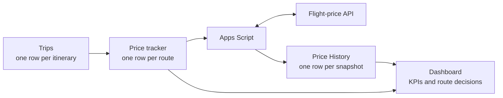

# Flight Tracker Dashboard

Turning “did the price drop yet?” into an automated yes or no.

The Flight Tracker Dashboard is a reusable Google Sheets decision-support framework for monitoring prices across a multi-leg itinerary. It combines a route-level tracker, a price history log, Apps Script and a flight-price API so a trip can be evaluated from one clear decision view.

## Why it exists

Multi-city trips are difficult to monitor when every flight leg has to be checked separately. This project brings the itinerary into one place and translates price movement into a practical next step:

- `BOOK` when a price drops meaningfully
- `MONITOR` when the price is holding steady
- `MONITOR — price increased` when a leg needs attention

The framework was built around a five-leg Egypt itinerary:

`Berlin → Hurghada → Cairo → Luxor → Berlin`

## What I built

- A KPI summary showing routes tracked, book-now signals, monitor signals and routes needing attention
- A route table comparing latest and previous prices, change and recommendation per leg
- A price history log that keeps every API snapshot attributable to the correct trip
- A live latest-versus-previous price comparison chart
- A reusable Trip ID structure so another itinerary can be added without rebuilding the dashboard
- A manual refresh control connected to the flight-price API through Apps Script

## Architecture

The key design decision is separating trip configuration from tracking logic. A new itinerary needs a new `Trip ID` and matching route rows; the tracker, history log and dashboard remain reusable.

## Data model

| Entity | Purpose |
| --- | --- |
| `Trips` | One row per itinerary, including Trip ID, dates, name and status |
| `Price tracker` | One row per monitored route leg, linked to a Trip ID |
| `Price History` | One row per API snapshot, preserving the time series |
| `Dashboard` | KPI summary, route recommendations and price comparison |

## Current operating state

The flight-price API is implemented and connected. Manual refresh is available. The scheduled trigger is currently paused, so the dashboard is explicit about what is automated and what still requires a refresh action.

## Stack

- Google Sheets
- Google Apps Script
- Flight-price API
- KPI dashboard
- Price history log

## Live project

[Open the live dashboard in Google Sheets](https://docs.google.com/spreadsheets/d/1OfpTWUFHfi1p1BYQHwuMXKHQgYB0NwSd7pQvhrfkysQ/edit)

The live sheet may require access permission depending on its sharing settings. No API keys, credentials or private configuration are stored in this repository.

## Documentation

- [Full case study](docs/case-study.md)

## Future improvements

- Resume scheduled refreshes on a sustainable cadence
- Add email or Slack alerts for price drops past a configurable threshold
- Add a “book by” estimate using historical volatility per route
- Extend Trip ID filtering across every tab

## Author

Stefania Licciardi — Commercial Analytics Engineer | Data & Business Analyst

[Portfolio](https://stefania.licciardi.net) · [LinkedIn](https://www.linkedin.com/in/stefanialicciardi/) · [GitHub](https://github.com/stefanialicciardi-byte)
